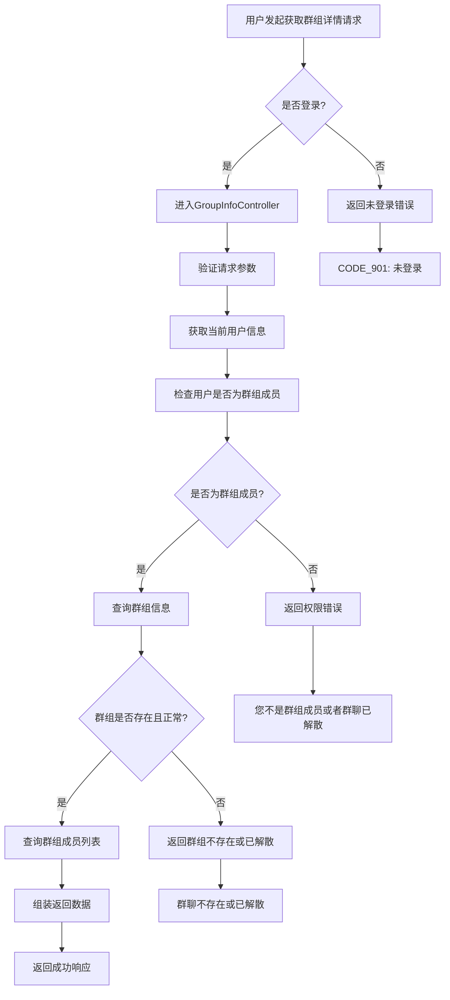

# 获取群组详情功能实现

## 1. 概述

本文档详细介绍了如何通过GroupInfoController、GroupInfoServiceImpl和GroupInfoMapper实现获取群组详情功能。该功能允许用户查看特定群组的详细信息，包括群组基本信息和群组成员列表。

## 2. 功能流程图



## 3. 核心组件详解

### 3.1 控制器层 GroupInfoController

GroupInfoController负责处理获取群组详情的HTTP请求。(GroupInfoController.java)

```java
@RestController("groupController")
@RequestMapping("/group")
@Validated
public class GroupInfoController extends ABaseController {
    @Autowired
    private GroupInfoService groupInfoService;
    @Autowired
    private UserContactService userContactService;

    /**
     * 获取群组详情信息
     * @param request 请求
     * @param groupId 群组id
     * @return GroupInfo 群组信息
     */
    private GroupInfo getGroupDetailCommon(HttpServletRequest request, String groupId) {
        TokenUserInfoDto userTokenInfo = getTokenUserInfo(request);

        // 查询当前用户是否是群组成员,以及群组的状态
        UserContact userContact = userContactService.getUserContactByUserIdAndContactId(userTokenInfo.getUserId(), groupId);
        if(userContact == null || !UserContactStatusEnum.FRIEND.getStatus().equals(userContact.getStatus())){
            throw new BusinessException("您不是群组成员或者群聊已解散");
        }

        // 查询群组信息
        GroupInfo groupInfo = groupInfoService.getGroupInfoByGroupId(groupId);
        if(groupInfo == null||!GroupStatusEnum.NORMAL.getStatus().equals(groupInfo.getStatus())){
            throw new BusinessException("群聊不存在或已解散");
        }

        return groupInfo;
    }

    /**
     * 加载群组信息
     * @param request 请求
     * @param groupId 群组id
     * @return ResponseVO(GroupInfo) 群组信息
     */
    @RequestMapping("/getGroupInfo")
    @GlobalInterceptor
    public ResponseVO loadMyGroup(HttpServletRequest request,@NotEmpty String groupId) {
        GroupInfo groupInfo = getGroupDetailCommon(request, groupId);

        // 获取群组成员数量
        UserContactQuery userContactQuery = new UserContactQuery();
        userContactQuery.setContactId(groupId);
        Integer memberCount = userContactService.findCountByParam(userContactQuery);

        groupInfo.setMemberCount(memberCount);

        return getSuccessResponseVO(groupInfo);
    }

    /**
     * 加载群组信息，用于聊天
     * @param request 请求
     * @param groupId 群组id
     * @return ResponseVO(GroupInfoVo) 群组信息
     */
    @RequestMapping("/getGroupInfo4chat")
    @GlobalInterceptor
    public ResponseVO getGroupInfo4chat(HttpServletRequest request,@NotEmpty String groupId) {
        GroupInfo groupInfo = getGroupDetailCommon(request, groupId);

        // 获取群组成员列表
        UserContactQuery userContactQuery = new UserContactQuery();
        userContactQuery.setContactId(groupId);
        userContactQuery.setQueryUserInfo(true);
        userContactQuery.setOrderBy("create_time asc");
        userContactQuery.setStatus(UserContactStatusEnum.FRIEND.getStatus());
        List<UserContact> userContactList = userContactService.findListByParam(userContactQuery);

        // 设置返回Vo对象，包含群组信息以及群组成员列表
        GroupInfoVo groupInfoVo = new GroupInfoVo();
        groupInfoVo.setGroupInfo(groupInfo);
        groupInfoVo.setUserContactList(userContactList);

        return getSuccessResponseVO(groupInfoVo);
    }
}
```

**关键要点：**
- 使用@GlobalInterceptor注解进行登录验证(GlobalInterceptor.java)
- 通过TokenUserInfo调用getTokenUserInfo()方法获取当前用户信息方法获取当前用户信息
- 提供两个获取群组详情的方法：
  1. GroupInfoController.getGroupInfo() - 获取基本群组信息和成员数
  2. GroupInfoController.getGroupInfo4chat() - 获取群组信息和成员列表，用于聊天场景

### 3.2 服务层 GroupInfoServiceImpl

GroupInfoServiceImpl提供获取群组信息的服务方法。(GroupInfoServiceImpl.java)

```java
/**
 * 根据GroupId获取对象
 */
@Override
public GroupInfo getGroupInfoByGroupId(String groupId) {
    return this.groupInfoMapper.selectByGroupId(groupId);
}
```

**关键步骤说明：**
1. **权限验证**：通过检查用户联系人关系确认用户是否为群组成员
2. **群组状态检查**：确认群组存在且状态正常（非解散状态）
3. **数据组装**：根据不同接口需求组装不同的返回数据

### 3.3 数据传输对象

#### GroupInfoVo - 群组详情VO对象

```java
@Data
public class GroupInfoVo {
    // 群组信息
    private GroupInfo groupInfo;
    // 群组成员列表
    private List<UserContact> userContactList;
}
```

#### GroupInfo - 群组信息实体类

```java
@Data
public class GroupInfo implements Serializable {
    /**
     * 群ID
     */
    private String groupId;

    /**
     * 群组名
     */
    private String groupName;

    /**
     * 群主id
     */
    private String groupOwnerId;

    /**
     * 状态 1:正常 0:解散
     */
    private int status;

    /**
     * 创建时间
     */
    @JsonFormat(pattern = "yyyy-MM-dd HH:mm:ss", timezone = "GMT+8")
    @DateTimeFormat(pattern = "yyyy-MM-dd HH:mm:ss")
    private Date createTime;

    /**
     * 群公告
     */
    private String groupNotice;

    /**
     * 0:直接加入1:管理员同意后加入
     */
    private Integer joinType;
    
    /**
     * 成员数量
     */
    private Integer memberCount;
}
```

## 4. 使用示例

前端通过GET/POST请求调用GroupInfoController的不同接口获取群组详情：

### 获取群组基本信息
```
POST /group/getGroupInfo
Headers:
  token: <user_token>
  
Form Data:
  groupId: "群组ID"
```

### 获取群组详细信息（含成员列表）
```
POST /group/getGroupInfo4chat
Headers:
  token: <user_token>
  
Form Data:
  groupId: "群组ID"
```

## 5. 实现原理

1. **身份验证**：通过@GlobalInterceptor注解验证用户登录状态(GlobalInterceptor.java)
2. **权限校验**：
   - 检查用户是否为群组成员
   - 检查群组状态是否正常
3. **数据查询**：
   - 查询群组基本信息
   - 查询群组成员列表（根据需要）
4. **数据组装**：根据不同接口需求组装不同格式的返回数据

## 6. 异常处理

系统定义了多种与获取群组详情相关的业务异常：

- `CODE_901`: 用户未登录
- `"您不是群组成员或者群聊已解散"`: 用户无权查看群组详情
- `"群聊不存在或已解散"`: 群组不存在或已被解散

## 7. 总结

通过以上实现，我们完成了以下功能：

1. **用户身份验证**：确保只有登录用户才能获取群组详情
2. **权限控制**：确保只有群组成员才能查看群组详情
3. **数据完整性**：确保只返回有效状态的群组信息
4. **灵活的数据返回**：根据不同的使用场景提供不同的数据格式
5. **良好的错误处理**：针对各种异常情况提供明确的错误提示

这种设计模式遵循了分层架构思想，将控制层、业务层和持久层分离，提高了代码的可维护性和可测试性。同时通过私有方法复用公共逻辑，避免了代码重复。