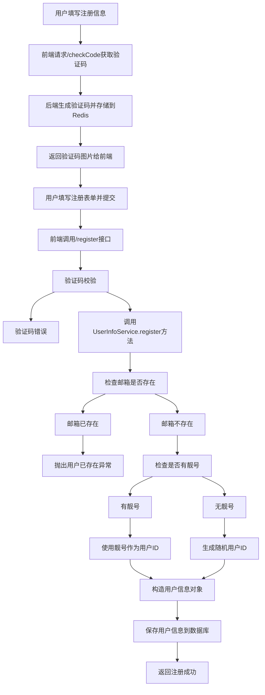
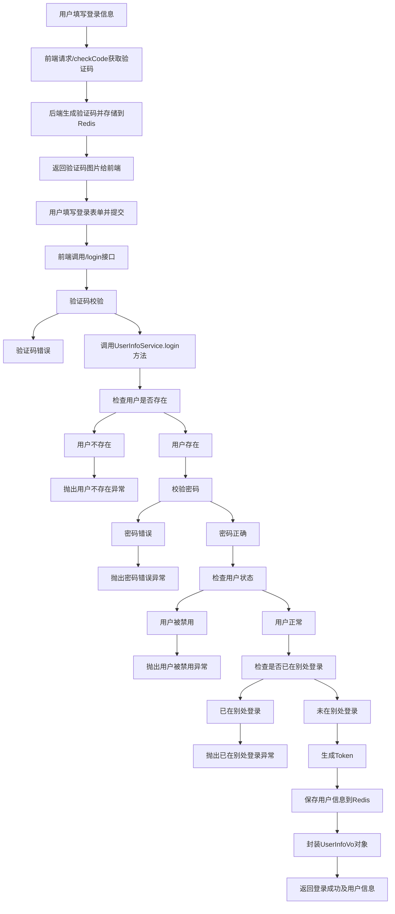

# EasyChat 登录和注册流程详解

## 1. 概述

本文档详细介绍了EasyChat系统的用户注册和登录流程，包括接口说明、方法调用链路以及相关实体类的作用。

## 2. 流程图

### 2.1 用户注册流程图

### 2.2 用户登录流程图

## 3. 接口详细说明

### 3.1 获取验证码接口

- **接口地址**: `/account/checkCode`
- **请求方式**: GET
- **功能说明**: 生成算术验证码图片和答案，存储到Redis中并返回给前端
- **返回内容**:
  - checkCode: 验证码图片(Base64编码)
  - checkCodeKey: 验证码键值，用于后续验证

### 3.2 用户注册接口

- **接口地址**: `/account/register`
- **请求方式**: POST
- **请求参数**:
  - checkCodeKey: 验证码键值
  - email: 用户邮箱
  - password: 用户密码
  - nickName: 用户昵称
  - checkCode: 用户输入的验证码
- **功能说明**: 完成用户注册流程
- **处理流程**:
  1. 验证验证码是否正确
  2. 调用 UserInfoService.register() 方法完成注册 (UserInfoService.java第107行)
  3. 清除验证码缓存

### 3.3 用户登录接口

- **接口地址**: `/account/login`
- **请求方式**: POST
- **请求参数**:
  - checkCodeKey: 验证码键值
  - email: 用户邮箱
  - password: 用户密码
  - checkCode: 用户输入的验证码
- **功能说明**: 完成用户登录流程
- **处理流程**:
  1. 验证验证码是否正确
  2. 调用 UserInfoService.login() 方法完成登录 (UserInfoService.java第112行)
  3. 清除验证码缓存

## 4. 核心方法调用链路

### 4.1 注册流程方法调用

1. AccountController.register() (AccountController.java第82行)
   - 接收前端注册请求
   - 验证验证码
   - 调用 UserInfoService.register() (UserInfoService.java第107行)

2. UserInfoServiceImpl.register() (UserInfoServiceImpl.java第225行)
   - 检查邮箱是否已存在
   - 生成用户ID（优先使用靓号）
   - 构造 UserInfo 对象 (UserInfo.java第13行)
   - 保存到数据库

### 4.2 登录流程方法调用

1. AccountController.login() (AccountController.java第119行)
   - 接收前端登录请求
   - 验证验证码
   - 调用 UserInfoService.login() (UserInfoService.java第112行)

2. UserInfoServiceImpl.login() (UserInfoServiceImpl.java第274行)
   - 根据邮箱查询用户
   - 验证密码
   - 检查用户状态
   - 检查是否已在别处登录
   - 生成Token并保存到Redis
   - 封装 UserInfoVo 返回给前端 (UserInfoVo.java第8行)

## 5. 关键实体类说明

### 5.1 UserInfo（用户信息实体类）

位于: com.itzpy.entity.po.UserInfo (UserInfo.java第13行)

表示系统中的用户信息，对应数据库中的 `user_info` 表。

主要字段:
- userId: 用户ID
- email: 用户邮箱
- nickname: 用户昵称
- password: 用户密码(MD5加密)
- status: 用户状态
- createTime: 创建时间

### 5.2 UserInfoVo（用户信息视图对象）

位于: com.itzpy.entity.vo.UserInfoVo (UserInfoVo.java第8行)

用于向前端返回用户信息的视图对象，包含了登录成功后需要返回的所有信息。

主要字段:
- token: 用户登录凭证
- admin: 是否为管理员
- 其他与 UserInfo 相同的字段

### 5.3 TokenUserInfoDto（Token用户信息传输对象）

位于: com.itzpy.entity.dto.TokenUserInfoDto

用于在Redis中存储用户登录信息的DTO对象。

主要字段:
- token: 用户凭证
- userId: 用户ID
- nickName: 用户昵称
- admin: 是否为管理员

## 6. 关键技术点

### 6.1 密码加密

使用MD5算法对用户密码进行加密存储，防止密码泄露。

### 6.2 Token生成与验证

模拟JWT方式生成Token，由用户ID和随机字符串组成，经过MD5加密后作为Token。

### 6.3 验证码机制

使用 `ArithmeticCaptcha` 生成算术验证码，防止机器人注册和登录。

### 6.4 防重复登录

通过Redis存储用户心跳时间，检测用户是否已在别处登录。

### 6.5 靓号机制

用户可以拥有靓号ID，注册时会优先使用靓号作为用户ID。

## 7. 异常处理

系统中定义了多种业务异常情况：
- 图片验证码错误
- 用户已存在
- 用户不存在
- 密码错误
- 用户被禁用
- 用户已在别处登录

所有异常都会通过全局异常处理器统一处理并返回给前端。