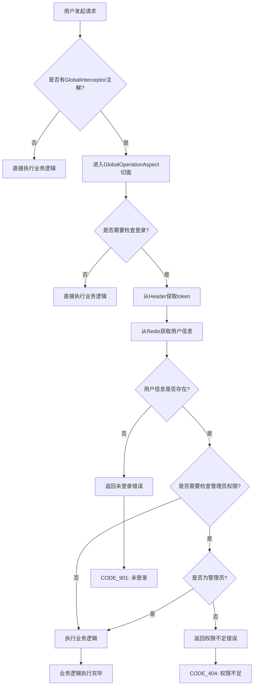

# 自定义注解与AOP切面实现登录校验功能

## 1. 概述

本文档详细介绍了如何通过自定义注解[@GlobalInterceptor](file:///D:/chat_learn/easychat-java/src/main/java/com/itzpy/annotation/GlobalInterceptor.java#L11-L14)和AOP切面[GlobalOperationAspect](file:///D:/chat_learn/easychat-java/src\..\..\src\main\java\com\itzpy\aspect\GlobalOperationAspect.java#L34-L77)实现系统的登录校验功能。这是一种优雅的方式，可以在不侵入业务代码的前提下，对需要登录验证的接口进行统一的身份认证。

## 2. 功能流程图



## 3. 核心组件详解

### 3.1 自定义注解 GlobalInterceptor

[GlobalInterceptor](file:///D:/chat_learn/easychat-java/src/main/java/com/itzpy/annotation/GlobalInterceptor.java#L11-L14)注解用于标记需要进行登录校验的控制器方法。

```java
package com.itzpy.annotation;

import java.lang.annotation.ElementType;
import java.lang.annotation.Retention;
import java.lang.annotation.RetentionPolicy;
import java.lang.annotation.Target;

@Target(ElementType.METHOD)
@Retention(RetentionPolicy.RUNTIME)
public @interface GlobalInterceptor {
    // 是否需要检查登录
    boolean checkLogin() default true;
    // 是否需要检查管理员身份
    boolean checkAdmin() default false;
}
```

**关键属性说明：**
- `checkLogin`: 控制是否需要进行登录验证，默认为true
- `checkAdmin`: 控制是否需要进行管理员权限验证，默认为false

### 3.2 AOP切面类 GlobalOperationAspect

[GlobalOperationAspect](file:///D:/chat_learn\easychat-java/src\..\..\src\main\java\com\itzpy\aspect\GlobalOperationAspect.java#L34-L77)是实现登录校验的核心切面类。

```java
package com.itzpy.aspect;

import com.itzpy.annotation.GlobalInterceptor;
import com.itzpy.constant.Constants;
import com.itzpy.entity.dto.TokenUserInfoDto;
import com.itzpy.entity.enums.ResponseCodeEnum;
import com.itzpy.exception.BusinessException;
import com.itzpy.redis.RedisUtils;
import lombok.extern.slf4j.Slf4j;
import org.aspectj.lang.JoinPoint;
import org.aspectj.lang.annotation.Aspect;
import org.aspectj.lang.annotation.Before;
import org.aspectj.lang.annotation.Pointcut;
import org.aspectj.lang.reflect.MethodSignature;
import org.springframework.beans.factory.annotation.Autowired;
import org.springframework.stereotype.Component;
import org.springframework.web.context.request.RequestContextHolder;
import org.springframework.web.context.request.ServletRequestAttributes;

import javax.servlet.http.HttpServletRequest;
import java.lang.reflect.Method;

@Slf4j
@Aspect
@Component
public class GlobalOperationAspect{
    @Autowired
    private RedisUtils redisUtils;

    @Pointcut("@annotation(com.itzpy.annotation.GlobalInterceptor)")
    public void pt(){}

    @Before("pt()")
    public void interceptorDo(JoinPoint joinPoint){
        try {
            log.info("进入全局拦截器，方法：{}", joinPoint.getSignature().getName());
            
            // 获取方法注解
            Method method = ((MethodSignature) joinPoint.getSignature()).getMethod();
            GlobalInterceptor globalInterceptor = method.getAnnotation(GlobalInterceptor.class);
            if(globalInterceptor ==  null){
                log.info("未找到GlobalInterceptor注解");
                return;
            }
            
            log.info("检测到GlobalInterceptor注解，checkLogin={}, checkAdmin={}", 
                globalInterceptor.checkLogin(), globalInterceptor.checkAdmin());
                
            if(globalInterceptor.checkLogin() || globalInterceptor.checkAdmin()){
                checkLogin(globalInterceptor.checkAdmin());
            }
        } catch (BusinessException e) {
            log.info("全局拦截器业务异常", e);
            throw e;
        } catch (Exception e){
            log.error("全局拦截器异常", e);
            throw new BusinessException(ResponseCodeEnum.CODE_500);
        } catch (Throwable e) {
            log.error("全局拦截器未知异常", e);
            throw new BusinessException(ResponseCodeEnum.CODE_500);
        }
    }

    private void checkLogin(boolean checkAdmin) {
        log.info("开始检查登录状态，checkAdmin={}", checkAdmin);
        
        // 获取请求
        ServletRequestAttributes attributes = (ServletRequestAttributes) RequestContextHolder.getRequestAttributes();
        if (attributes == null) {
            log.warn("无法获取请求上下文");
            throw new BusinessException(ResponseCodeEnum.CODE_500);
        }
        
        HttpServletRequest request = attributes.getRequest();
        String token = request.getHeader("token");
        log.info("获取到token: {}", token);

        // 获取用户
        TokenUserInfoDto tokenUserInfoDto = (TokenUserInfoDto) redisUtils.get(Constants.REDIS_KEY_WS_TOKEN + token);

        if(tokenUserInfoDto == null){
            log.info("用户未登录或token无效");
            throw new BusinessException(ResponseCodeEnum.CODE_901);
        }

        if(checkAdmin && !tokenUserInfoDto.isAdmin()){
            log.info("用户不是管理员，无权访问");
            throw new BusinessException(ResponseCodeEnum.CODE_404);
        }
        
        log.info("用户验证通过，userId: {}", tokenUserInfoDto.getUserId());
    }
}
```

## 4. 使用示例

在控制器方法上使用[@GlobalInterceptor](file:///D:/chat_learn\easychat-java/src\..\..\src\main\java\com\itzpy\annotation\GlobalInterceptor.java#L11-L14)注解：

```java
@RestController("groupController")
@RequestMapping("/group")
public class GroupInfoController extends ABaseController {
    @Autowired
    private GroupInfoService groupInfoService;

    // 只进行登录验证
    @GlobalInterceptor
    @RequestMapping("/saveGroup")
    public ResponseVO saveGroup(
            HttpServletRequest request,
            String groupId,
            @NotEmpty String groupName,
            String groupNotice,
            @NotNull Integer joinType,
            MultipartFile avatarFile,
            MultipartFile avatarCover) {
        // 业务逻辑
        return getSuccessResponseVO(null);
    }

    // 不进行任何验证
    @GlobalInterceptor(checkLogin = false)
    @RequestMapping("/getPublicGroupInfo")
    public ResponseVO getPublicGroupInfo(String groupId) {
        // 业务逻辑
        return getSuccessResponseVO(null);
    }

    // 需要管理员权限
    @GlobalInterceptor(checkAdmin = true)
    @RequestMapping("/deleteGroup")
    public ResponseVO deleteGroup(HttpServletRequest request, String groupId) {
        // 业务逻辑
        return getSuccessResponseVO(null);
    }
}
```

## 5. 实现原理

1. **注解定义**：通过[@Target(ElementType.METHOD)](file:///D:/chat_learn/easychat-java/src/main/java/com/itzpy/annotation/GlobalInterceptor.java#L9-L9)和[@Retention(RetentionPolicy.RUNTIME)](file:///D:/chat_learn/easychat-java/src/main/java/com/itzpy/annotation/GlobalInterceptor.java#L10-L10)定义运行时可见的方法级注解

2. **切点表达式**：`@Pointcut("@annotation(com.itzpy.annotation.GlobalInterceptor)")` 匹配所有被[@GlobalInterceptor](file:///D:/chat_learn\easychat-java/src\..\..\src\main\java\com\itzpy\annotation\GlobalInterceptor.java#L11-L14)注解标记的方法

3. **前置通知**：[@Before("pt()")](file:///D:/chat_learn\easychat-java/src/main/java/com/itzpy/aspect/GlobalOperationAspect.java#L49-L59)在目标方法执行前进行拦截处理

4. **权限验证流程**：
   - 从HTTP请求头获取token
   - 通过token从Redis中获取用户信息
   - 根据注解参数决定是否验证登录状态和管理员权限
   - 验证失败则抛出相应业务异常

## 6. 异常处理

系统定义了多种与登录校验相关的业务异常码：

- `CODE_901`: 用户未登录
- `CODE_404`: 权限不足（非管理员访问管理员接口）
- `CODE_500`: 系统内部错误

## 7. 总结

通过自定义注解[@GlobalInterceptor](file:///D:/chat_learn\easychat-java/src/main/java/com/itzpy/annotation/GlobalInterceptor.java#L11-L14)和AOP切面[GlobalOperationAspect](file:///D:/chat_learn\easychat-java/src\..\..\src\main\java\com\itzpy\aspect\GlobalOperationAspect.java#L34-L77)，我们实现了以下优势：

1. **代码解耦**：将登录校验逻辑从业务代码中完全分离
2. **灵活配置**：通过注解参数控制不同的验证级别
3. **易于维护**：集中管理所有登录校验逻辑
4. **复用性强**：一处定义，多处使用

这种设计模式符合面向切面编程(AOP)的思想，提高了系统的可维护性和可扩展性。