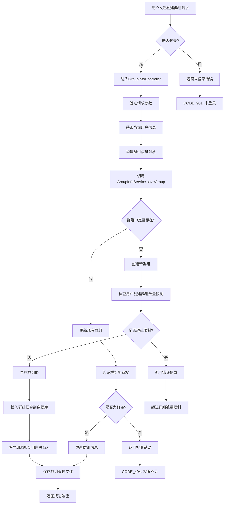

# 创建群组功能实现

## 1. 概述

本文档详细介绍了如何通过GroupInfoController、GroupInfoServiceImpl和GroupInfoMapper实现群组创建功能。该功能允许用户创建新的聊天群组，包括设置群组名称、公告、加入方式等基本信息，并上传群组头像。

## 2. 功能流程图



## 3. 核心组件详解

### 3.1 控制器层 GroupInfoController

GroupInfoController负责处理创建群组的HTTP请求。(GroupInfoController.java)

```java
@RestController("groupController")
@RequestMapping("/group")
@Validated
public class GroupInfoController extends ABaseController {
    @Autowired
    private GroupInfoService groupInfoService;

    /**
     * 保存群组，用于创建群组或者修改群组信息
     * @param request 请求
     * @param groupId 群组id
     * @param groupName 群组名称
     * @param groupNotice 群组公告
     * @param joinType 加入方式
     * @param avatarFile 头像（点击群头像后查看到高清的图片）
     * @param avatarCover 头像（缩略图）
     * @return ResponseVO(null)
     */
    @GlobalInterceptor
    @RequestMapping("/saveGroup")
    public ResponseVO saveGroup(
            HttpServletRequest request,
            String groupId,
            @NotEmpty String groupName,
            String groupNotice,
            @NotNull Integer joinType,
            MultipartFile avatarFile,
            MultipartFile avatarCover) throws IOException {

        // 获取tokenUserInfo,得知当前用户信息，方便群组创建信息填入
        TokenUserInfoDto userTokenInfo = getTokenUserInfo(request);

        GroupInfo groupInfo = new GroupInfo();
        groupInfo.setGroupId(groupId);
        groupInfo.setGroupOwnerId(userTokenInfo.getUserId());
        groupInfo.setGroupName(groupName);
        groupInfo.setGroupNotice(groupNotice);
        groupInfo.setJoinType(joinType);
        groupInfoService.saveGroup(groupInfo, avatarFile, avatarCover);

        return getSuccessResponseVO(null);
    }
}
```

**关键要点：**
- 使用@GlobalInterceptor注解进行登录验证(GlobalInterceptor.java)
- 通过TokenUserInfo调用getTokenUserInfo()方法获取当前用户信息方法获取当前用户信息
- 使用GroupInfoService.saveGroup()方法处理群组创建或更新逻辑(GroupInfoService.java)

### 3.2 服务层 GroupInfoServiceImpl

GroupInfoServiceImpl是实现群组创建功能的核心服务类。(GroupInfoServiceImpl.java)

```java
@Override
@Transactional(rollbackFor = Exception.class)
public void saveGroup(GroupInfo groupInfo, MultipartFile avatarFile, MultipartFile avatarCover) throws IOException {
    Date curDate = new Date();

    //个人新建群组,群组id不存在则可以创建。
    if(StringTools.isEmpty(groupInfo.getGroupId())){
        GroupInfoQuery groupInfoQuery = new GroupInfoQuery();
        groupInfoQuery.setGroupOwnerId(groupInfo.getGroupOwnerId());
        Integer count = this.groupInfoMapper.selectCount(groupInfoQuery);
        SysSettingDto sysSetting = redisComponent.getSysSetting();

        // 如果已经创建群组数量超出限制
        if(count >= sysSetting.getMaxGroupAccount()){
            throw new RuntimeException("最多只能创建"+sysSetting.getMaxGroupAccount()+"个群组");
        }

        // 如果群组id为空
        if(avatarFile == null){
            throw new BusinessException(ResponseCodeEnum.CODE_600);
        }

        groupInfo.setCreateTime(curDate);
        groupInfo.setGroupId(StringTools.getGroupId());

        this.groupInfoMapper.insert(groupInfo);

        // 将群组添加为联系人
        UserContact userContact = new UserContact();
        userContact.setStatus(UserContactStatusEnum.FRIEND.getStatus());
        userContact.setContactType(UserContactTypeEnum.GROUP.getType());
        userContact.setContactId(groupInfo.getGroupId());
        userContact.setUserId(groupInfo.getGroupOwnerId());
        userContact.setCreateTime(curDate);
        userContact.setLastUpdateTime(curDate);
        this.userContactMapper.insert(userContact);

        //TODO: 群创建后创建会话
        //TODO: 立刻发送消息

    }
    // 如果群id存在了，进行群组修改
    else{
        // 判断群组id是否属于当前用户(群组所有者判断)
        GroupInfo dbInfo = this.groupInfoMapper.selectByGroupId(groupInfo.getGroupId());
        if(!dbInfo.getGroupOwnerId().equals(groupInfo.getGroupOwnerId())){
            throw new BusinessException(ResponseCodeEnum.CODE_600);
        }
        this.groupInfoMapper.updateByGroupId(groupInfo, groupInfo.getGroupId());

        // TODO: 更新相关表冗余信息

        // TODO: 修改群昵称发送ws消息

    }

    if(avatarFile == null){
        return;
    }

    // 设置本地指定保存群头像目录
    String baseFolder = appConfig.getProjectFolder() + Constants.FILE_FOLDER_FILE;
    File targetFileFolder = new File(baseFolder + Constants.FILE_FOLDER_AVATAR_NAME);
    if(!targetFileFolder.exists()){
        targetFileFolder.mkdirs();
    }
    // 保存群头像以及缩略头像到指定目录中
    String filePath = targetFileFolder.getPath() + "/" + groupInfo.getGroupId() + Constants.IMAGE_SUFFIX;
    avatarFile.transferTo(new File(filePath));
    avatarCover.transferTo(new File(filePath + Constants.COVER_IMAGE_SUFFIX));
}
```

**关键步骤说明：**
1. **事务管理**：使用@Transactional注解保证数据一致性
2. **创建新群组**：当groupId为空时执行创建逻辑(GroupInfo.java)
3. **数量限制检查**：通过查询用户已创建群组数量并与系统设置比较
4. **群组ID生成**：使用StringTools.java生成唯一ID
5. **添加联系人**：将新创建的群组添加到创建者的联系人列表中
6. **头像处理**：保存高清头像和缩略头像文件

### 3.3 持久层 GroupInfoMapper

GroupInfoMapper接口及其实现提供了数据访问能力。(GroupInfoMapper.java)

```xml
<insert id="insert" parameterType="com.itzpy.entity.po.GroupInfo">
     INSERT INTO group_info
     <trim prefix="(" suffix=")" suffixOverrides="," >
        <if test="bean.groupId != null">
             group_id,
        </if>
        <if test="bean.groupName != null">
             group_name,
        </if>
        <if test="bean.groupOwnerId != null">
             group_owner_id,
        </if>
        <if test="bean.createTime != null">
             create_time,
        </if>
        <if test="bean.groupNotice != null">
             group_notice,
        </if>
        <if test="bean.joinType != null">
             join_type,
        </if>
     </trim>
     <trim prefix="values (" suffix=")" suffixOverrides="," >
        <if test="bean.groupId!=null">
             #{bean.groupId},
        </if>
        <if test="bean.groupName!=null">
             #{bean.groupName},
        </if>
        <if test="bean.groupOwnerId!=null">
             #{bean.groupOwnerId},
        </if>
        <if test="bean.createTime!=null">
             #{bean.createTime},
        </if>
        <if test="bean.groupNotice!=null">
             #{bean.groupNotice},
        </if>
        <if test="bean.joinType!=null">
             #{bean.joinType},
        </if>
     </trim>
</insert>
```

## 4. 使用示例

前端通过POST请求调用GroupInfoController.saveGroup()接口创建/更新群组：(GroupInfoController.java)

```
POST /group/saveGroup
Headers:
  token: <user_token>
  
Form Data:
  groupName: "技术交流群"
  groupNotice: "欢迎加入技术交流群"
  joinType: 0
  avatarFile: <image_file>
  avatarCover: <cover_image_file>
```

## 5. 实现原理

1. **身份验证**：通过@GlobalInterceptor注解验证用户登录状态(GlobalInterceptor.java)
2. **参数校验**：使用@NotEmpty和@NotNull注解进行参数校验
3. **业务逻辑**：
   - 查询用户已创建群组数量，检查是否超过系统限制
   - 检查是否存在群组ID
   - 不存在则生成唯一群组ID
   - 插入群组信息到数据库
   - 将群组添加到用户联系人列表
   - 保存群组头像文件
4. **事务处理**：使用Spring事务管理确保数据一致性
5. **文件存储**：将群组头像保存到指定目录

## 6. 异常处理

系统定义了多种与群组创建相关的业务异常：

- `CODE_901`: 用户未登录
- `CODE_600`: 请求参数错误或权限不足
- `CODE_500`: 系统内部错误

## 7. 总结

通过以上实现，我们完成了以下功能：

1. **用户身份验证**：确保只有登录用户才能创建群组
2. **参数校验**：对必要参数进行校验，防止非法数据入库
3. **数量限制**：根据系统设置限制用户创建群组的数量
4. **数据一致性**：通过事务管理确保群组信息和联系人信息同时更新
5. **文件处理**：支持群组头像上传和存储
6. **可扩展性**：预留了群组创建后的会话创建和消息发送功能

这种设计模式遵循了分层架构思想，将控制层、业务层和持久层分离，提高了代码的可维护性和可测试性。